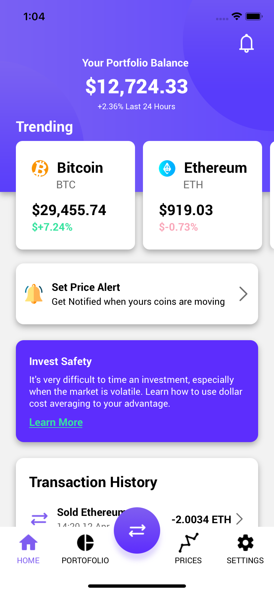
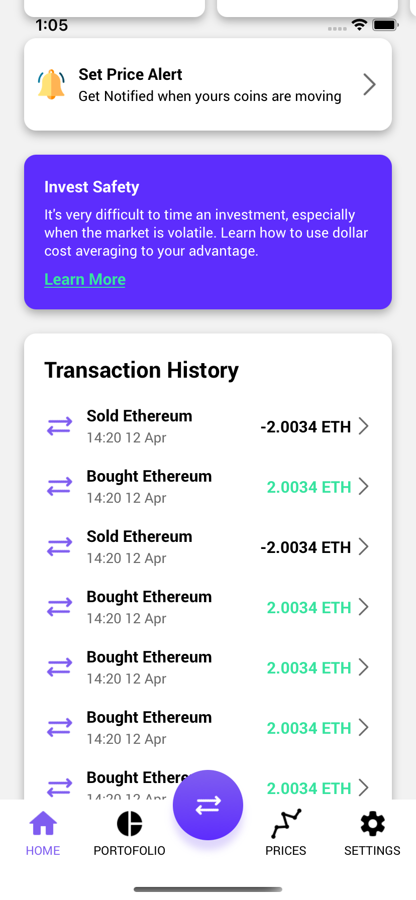
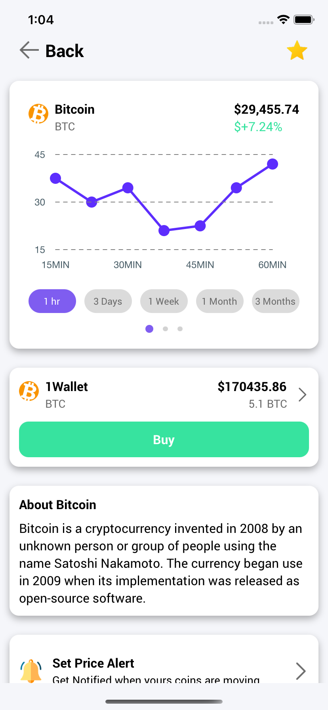
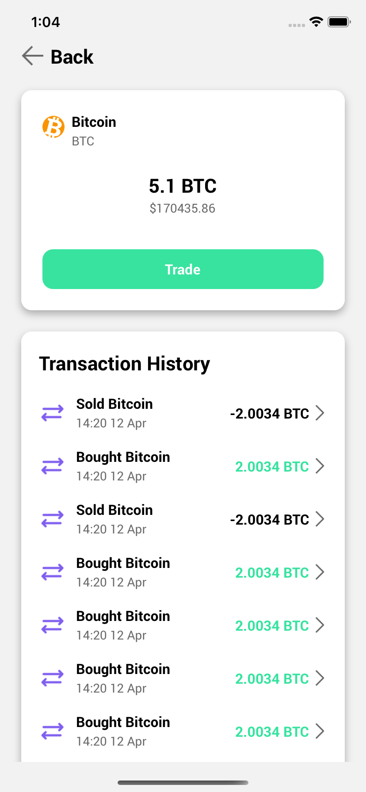

 CryptoCurrency [React-Native] -  by ng_xcv 

Il s'agit la d'une application de Cryptocurrency app basée sur le design créé par David Morgan sur Dribbble.  

 

## Table de matières

| Code | Projet          | Preview                                                                                                                                                     | Inspiration                                                       | Nombre d'écrans |
| ---- | --------------- | ----------------------------------------------------------------------------------------------------------------------------------------------------------- | ----------------------------------------------------------------- | --------------- |
| RN01 | Crypto Currency |  | [Vue](https://dribbble.com/shots/14896748-Cryptocoin-App-concept) | 4               |

## Remerciements

